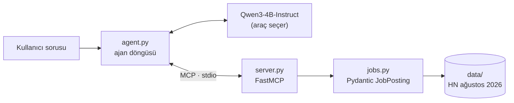
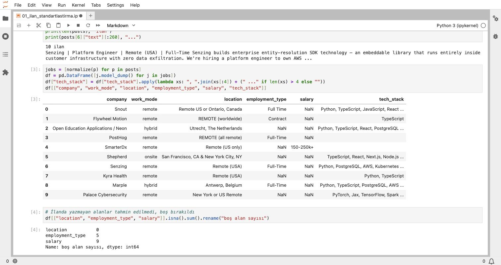
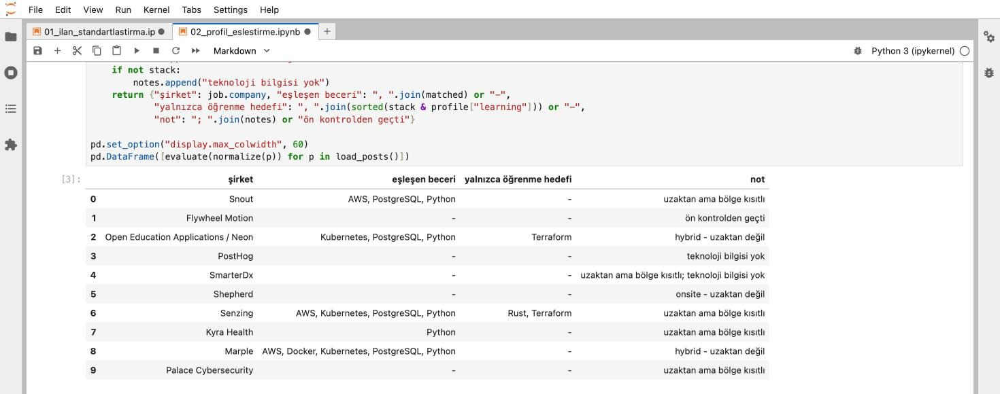
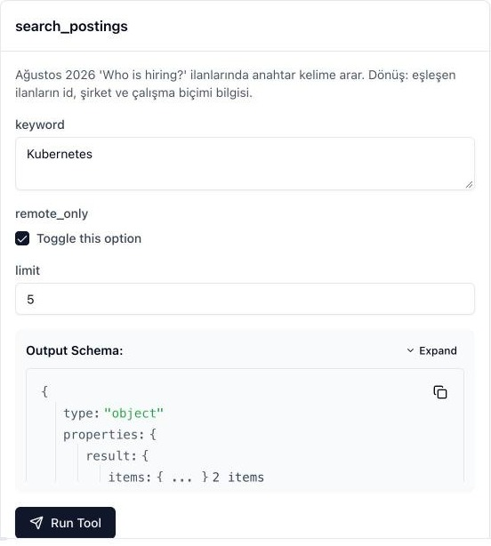
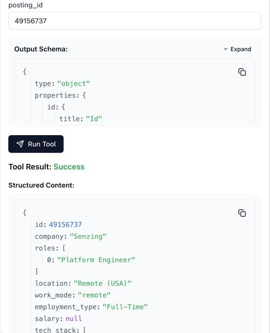
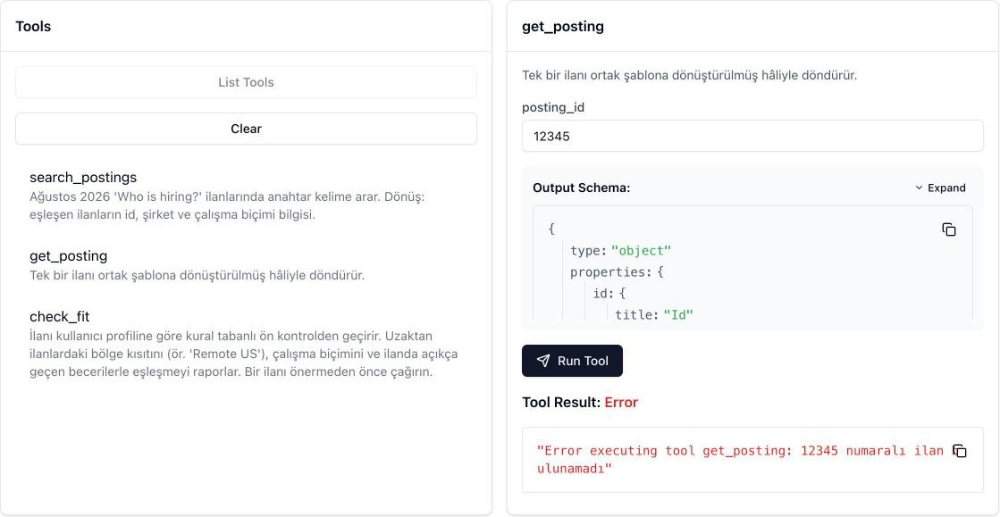
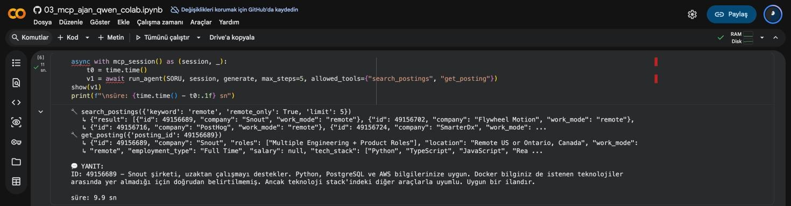
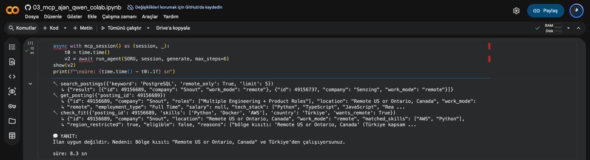

# İş Fırsatı Ajanı · MCP Sunucusu + Qwen3 Araç Çağırma

[](https://github.com/alimdemir/job-opportunity-mcp-agent/actions/workflows/ci.yml)
[](https://colab.research.google.com/github/alimdemir/job-opportunity-mcp-agent/blob/main/notebooks/03_mcp_ajan_qwen_colab.ipynb)


Hacker News'teki **"Ask HN: Who is hiring?"** ilanlarını ortak bir şablona dönüştüren, bunları [Model Context Protocol](https://modelcontextprotocol.io) araçları olarak sunan ve bir dil modelinin bu araçları kendi seçerek kullandığı küçük bir iş fırsatı ajanı. AVD Teknoloji Danışmanlık'taki stajımın (2026) ikinci haftasında geliştirdim.

## Nasıl çalışıyor



1. **Standartlaştırma** (`jobs.py`): serbest biçimli ilan metni `JobPosting` şablonuna dönüştürülür (şirket, roller, konum, çalışma biçimi, çalışma türü, ücret, teknolojiler, kaynak). **İlanda açıkça yazmayan bilgi tahmin edilmez, `None` kalır.**
2. **MCP sunucusu** (`server.py`):
   - `search_postings(keyword, remote_only=False, limit=5)`: anahtar kelimeyle ilan arar
   - `get_posting(posting_id)`: tek ilanı şablonda döndürür, ilan yoksa `ToolError` verir (boş sonuç "uygun ilan yok" diye yorumlanmasın diye)
   - `check_fit(posting_id, skills, country, wants_remote)`: kural tabanlı ön kontrol. Bölge kısıtını (`Remote US` gibi), çalışma biçimini ve ilanda açıkça geçen becerilerle eşleşmeyi `FitReport` olarak döndürür
   - `hn://threads/2026-08` kaynağı: kullanılan başlığın bilgisi
   - Loglar stdout'a değil stderr'e yazılır, çünkü stdio taşımasında stdout protokole ayrılmış.
3. **Ajan döngüsü** (`agent.py`): MCP araç listesi, modele fonksiyon tanımı olarak verilir. Model `<tool_call>` ürettikçe araç çağrılır ve sonuç `role=tool` mesajıyla geri beslenir. Aynı çağrı tekrarlanırsa sunucuya gitmez; en fazla `max_steps` adım çalışır.

## Kurulum

```bash
python -m venv .venv && source .venv/bin/activate
pip install -r requirements-dev.txt
pytest -v                                   # 14 test
```

### MCP Inspector ile deneme

```bash
npx @modelcontextprotocol/inspector python server.py
```

### Claude Desktop / VS Code'a ekleme

```json
{
  "mcpServers": {
    "hn-jobs": { "command": "/tam/yol/.venv/bin/python", "args": ["/tam/yol/server.py"] }
  }
}
```

## Not defterleri

| Not defteri | Ortam | İçerik |
|---|---|---|
| [`01_ilan_standartlastirma`](notebooks/01_ilan_standartlastirma.ipynb) | CPU | 10 ilanın şablona dönüşümü, boş bırakılan alanların sayımı |
| [`02_profil_eslestirme`](notebooks/02_profil_eslestirme.ipynb) | CPU | Örnek profil ile ön kontrol: eşleşen beceri, yalnızca öğrenme hedefi, bölge kısıtı |
| [`03_mcp_ajan_qwen_colab`](notebooks/03_mcp_ajan_qwen_colab.ipynb) | Colab A100 | MCP istemcisi + Qwen3-4B-Instruct-2507: yalnız arama araçlarıyla ve `check_fit` ile iki sürümün karşılaştırması, hata senaryosu |

## Öğrendiklerim / tasarım kararları

- **Eksik bilgi ≠ olumsuz bilgi.** Ücretin yazmaması düşük olduğu anlamına gelmez. 10 ilanın 9'unda ücret, 5'inde çalışma türü yok; bu alanlar boş bırakıldı.
- **"Remote" her zaman uzaktan değil.** `Remote (USA)` gibi ifadeler bölge kısıtı taşıyor. Colab denemesinde (A100) Qwen3-4B yalnız arama araçlarıyla çalışırken *Remote US or Ontario, Canada* ilanını Türkiye'den çalışan kullanıcıya "uygun" dedi (9.9 sn). `check_fit` eklenen ikinci sürümde model aracı çağırıp ilanın bölge kısıtı yüzünden uygun olmadığını söyledi (8.3 sn). Bu kararı modele bırakmak yerine `check_fit` aracını ekledim; sistem istemi öneriden önce bu aracın çağrılmasını istiyor.
- **Öğrenme hedefi deneyim sayılmaz.** Profildeki "öğrenmek istediği" teknolojiler eşleşen beceri olarak sayılmıyor.
- **Araç açıklaması, modelin arayüzü.** FastMCP şemayı docstring ve tür ipuçlarından üretiyor; parametre adları ve açıklamalar Inspector'da modelin gördüğü biçimde kontrol edildi.

## Veri

`data/hn_whoishiring_2026_08.json`: [Ask HN: Who is hiring? (August 2026)](https://news.ycombinator.com/item?id=49156683) başlığındaki ilk 10 üst seviye ilan. İçerik herkese açık; e-posta adresleri ve kullanıcı adları çıkarıldı.

## Ekran görüntüleri

Not defterleri 01–02 ve MCP Inspector görüntüleri MacBook Air (Apple Silicon, Python 3.12) üzerinde, Colab görüntüleri A100 GPU'da alındı.

| | |
|---|---|
| <br/>İlanların ortak şablona dönüşümü | <br/>Örnek profil ile ön kontrol |
| <br/>`search_postings` aracının Inspector'daki şeması | <br/>`get_posting` başarılı çağrı (ücret belirtilmediği için `null`) |
| <br/>Olmayan ilan: `ToolError` | |
| <br/>Colab A100 · 1. sürüm: yalnız arama araçlarıyla bölge kısıtı gözden kaçıyor | <br/>Colab A100 · 2. sürüm: `check_fit` ile doğru karar |

## Lisans

[MIT](LICENSE)
